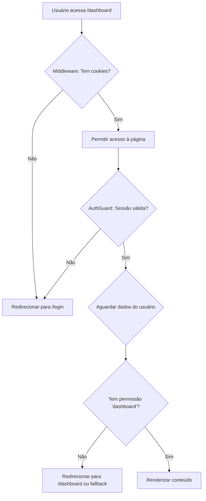

# 🔒 Sistema de Proteção de Rotas

Sistema robusto de autenticação e autorização implementado em múltiplas camadas para garantir segurança máxima.

## 📋 Índice
- [Visão Geral](#visão-geral)
- [Arquitetura em Camadas](#arquitetura-em-camadas)
- [Como Usar](#como-usar)
- [Exemplos de Implementação](#exemplos-de-implementação)
- [Fluxo de Autenticação](#fluxo-de-autenticação)
- [Troubleshooting](#troubleshooting)

---

## 🎯 Visão Geral

O sistema de proteção de rotas do GestãoConsert é implementado em **4 camadas** de segurança:

1. **Middleware (Server-side)** - Primeira linha de defesa
2. **AuthGuard (Client-side)** - Proteção individual de páginas
3. **MenuLayout** - Controle de menu baseado em permissões
4. **Componentes** - Verificação granular de acesso

---

## 🏗️ Arquitetura em Camadas

### Camada 1: Middleware (Server-side)

**Arquivo:** `/middleware.ts`

**Responsabilidades:**
- ✅ Bloquear acesso a rotas privadas sem autenticação
- ✅ Verificar presença de cookies de autenticação do Supabase
- ✅ Redirecionar usuários não autenticados para `/login`
- ✅ Preservar URL de destino para redirecionamento pós-login
- ✅ Permitir acesso a rotas públicas sem verificação

**Rotas Públicas (não exigem autenticação):**
```typescript
[
  '/login',
  '/cadastro', 
  '/',
  '/sobre',
  '/termos',
  '/politicas-privacidade',
  '/planos',
  '/pagamentos/*',
  '/instrucoes-verificacao',
  '/os/*', // Rotas públicas de OS
]
```

**Como funciona:**
1. Intercepta todas as requisições antes de chegarem às páginas
2. Verifica se a rota é pública
3. Se não for pública, verifica cookies de autenticação
4. Se não houver cookies válidos, redireciona para `/login?redirect=/caminho-original`
5. Se houver cookies válidos, permite o acesso (verificação completa no client-side)

---

### Camada 2: AuthGuard (Client-side)

**Arquivo:** `/src/components/AuthGuard.tsx`

**Responsabilidades:**
- ✅ Verificar sessão válida no Supabase
- ✅ Aguardar carregamento de dados do usuário
- ✅ Verificar permissões específicas da página
- ✅ Mostrar loading durante verificação
- ✅ Redirecionar para login ou fallback se não autorizado
- ✅ Prevenir flash de conteúdo não autorizado

**Props:**
```typescript
interface AuthGuardProps {
  children: React.ReactNode;
  requiredPermission?: string;  // Permissão necessária (ex: 'ordens', 'clientes')
  fallbackPath?: string;         // Caminho de redirecionamento (padrão: '/dashboard')
  showLoading?: boolean;         // Mostrar loading (padrão: true)
}
```

**Como funciona:**
1. Verifica sessão do Supabase via `supabase.auth.getSession()`
2. Se não há sessão, redireciona para `/login`
3. Aguarda dados do usuário do contexto `AuthContext`
4. Verifica se o usuário tem a permissão necessária
5. Se não tiver, redireciona para `fallbackPath`
6. Se tudo OK, renderiza o conteúdo

**Estados de Loading:**
- `isChecking`: Está verificando autenticação
- `isAuthorized`: Verificação completa e autorizado

---

### Camada 3: MenuLayout

**Arquivo:** `/src/components/MenuLayout.tsx`

**Responsabilidades:**
- ✅ Mostrar/ocultar itens de menu baseado em permissões
- ✅ Verificar nível de acesso do usuário
- ✅ Prevenir navegação para páginas não autorizadas

**Função de verificação:**
```typescript
const podeVer = (area: string) => {
  // Usuários de teste têm acesso total
  if (usuarioData?.nivel === 'usuarioteste') return true;
  
  // Técnicos sempre podem ver dashboard
  if (area === 'dashboard' && usuarioData?.nivel === 'tecnico') return true;
  
  // Admin ou tem permissão específica
  return usuarioData?.nivel === 'admin' || 
         usuarioData?.permissoes?.includes(area);
}
```

---

### Camada 4: AuthContext

**Arquivo:** `/src/context/AuthContext.tsx`

**Responsabilidades:**
- ✅ Gerenciar estado global de autenticação
- ✅ Carregar dados do usuário e empresa
- ✅ Fornecer informações de sessão para toda a aplicação
- ✅ Listener de mudanças de autenticação

---

## 🚀 Como Usar

### 1. Proteger uma Página Nova

Para adicionar proteção a uma nova página, siga estes passos:

#### Passo 1: Adicionar permissão no arquivo de configuração

**Arquivo:** `/src/config/pagePermissions.ts`

```typescript
export const PAGE_PERMISSIONS = {
  // ... outras páginas
  '/minha-nova-pagina': 'nome-da-permissao',
}
```

#### Passo 2: Envolver a página com AuthGuard

**Arquivo:** `/src/app/minha-nova-pagina/page.tsx`

```tsx
'use client';

import AuthGuard from '@/components/AuthGuard';
import MenuLayout from '@/components/MenuLayout';

export default function MinhaNovaPage() {
  return (
    <AuthGuard requiredPermission="nome-da-permissao">
      <MenuLayout>
        {/* Seu conteúdo aqui */}
        <h1>Minha Nova Página</h1>
      </MenuLayout>
    </AuthGuard>
  );
}
```

#### Passo 3: Adicionar item no menu (se necessário)

**Arquivo:** `/src/components/MenuLayout.tsx`

```tsx
{podeVer('nome-da-permissao') && (
  <SidebarButton 
    path="/minha-nova-pagina" 
    icon={<FiIcon size={20} />} 
    label="Minha Nova Página" 
    isActive={pathname === '/minha-nova-pagina'} 
    menuRecolhido={menuRecolhido} 
  />
)}
```

---

## 📚 Exemplos de Implementação

### Exemplo 1: Dashboard (Página Protegida)

```tsx
'use client';

import AuthGuard from '@/components/AuthGuard';
import MenuLayout from '@/components/MenuLayout';

export default function DashboardPage() {
  return (
    <AuthGuard requiredPermission="dashboard">
      <MenuLayout>
        <h1>Dashboard</h1>
        {/* Conteúdo do dashboard */}
      </MenuLayout>
    </AuthGuard>
  );
}
```

### Exemplo 2: Página Somente Admin

```tsx
'use client';

import AuthGuard from '@/components/AuthGuard';
import MenuLayout from '@/components/MenuLayout';

export default function ConfiguracoesPage() {
  return (
    <AuthGuard 
      requiredPermission="configuracoes"
      fallbackPath="/dashboard"
    >
      <MenuLayout>
        <h1>Configurações</h1>
        {/* Só admins verão isso */}
      </MenuLayout>
    </AuthGuard>
  );
}
```

### Exemplo 3: Página Sem Loading Customizado

```tsx
'use client';

import AuthGuard from '@/components/AuthGuard';
import MenuLayout from '@/components/MenuLayout';

export default function MinhaPage() {
  return (
    <AuthGuard 
      requiredPermission="minha-permissao"
      showLoading={false}
    >
      <MenuLayout>
        {/* Sem loading UI do AuthGuard */}
      </MenuLayout>
    </AuthGuard>
  );
}
```

### Exemplo 4: Página Pública (Sem Proteção)

Para páginas que **não** devem ser protegidas (landing page, sobre, etc):

1. Adicionar no `middleware.ts` na lista `publicPaths`
2. **NÃO** usar o `AuthGuard`

```tsx
'use client';

export default function SobrePage() {
  return (
    <div>
      <h1>Sobre Nós</h1>
      {/* Página totalmente pública */}
    </div>
  );
}
```

---

## 🔄 Fluxo de Autenticação

### Fluxo Completo de Acesso a uma Página Protegida



### Estados Durante o Fluxo

| Estado | Middleware | AuthGuard | Usuário Vê |
|--------|-----------|-----------|------------|
| 1. Inicial | ⏳ Verificando | - | Nada (aguardando) |
| 2. Sem cookies | ❌ Redireciona | - | Tela de login |
| 3. Com cookies | ✅ Passa | ⏳ Verificando | Loading do AuthGuard |
| 4. Sessão inválida | - | ❌ Redireciona | Tela de login |
| 5. Sem permissão | - | ❌ Redireciona | Fallback page |
| 6. Autorizado | - | ✅ Renderiza | Conteúdo da página |

---

## 🛠️ Troubleshooting

### Problema: Loop infinito de redirecionamento

**Causa:** Página de login está sendo bloqueada pelo middleware

**Solução:** Verificar se `/login` está na lista `publicPaths` do middleware

```typescript
// middleware.ts
const publicPaths = [
  '/login', // ✅ Deve estar aqui
  // ...
];
```

---

### Problema: Usuário autenticado não consegue acessar página

**Causa:** Permissão não configurada ou usuário não tem a permissão

**Diagnóstico:**
1. Verificar se a permissão está em `pagePermissions.ts`
2. Verificar permissões do usuário no banco de dados:
```sql
SELECT nivel, permissoes FROM usuarios WHERE email = 'usuario@exemplo.com';
```

**Solução:**
- Para admin: `nivel = 'admin'` (tem acesso a tudo)
- Para outros: adicionar permissão no array `permissoes`

---

### Problema: Loading infinito

**Causa:** AuthContext não está carregando dados do usuário

**Diagnóstico:**
1. Abrir DevTools Console
2. Procurar por erros do Supabase
3. Verificar se `empresaData` e `usuarioData` estão sendo carregados

**Solução:**
```typescript
// Adicionar timeout no AuthGuard
// O componente já tem isso implementado
```

---

### Problema: Flash de conteúdo não autorizado

**Causa:** Renderização acontece antes da verificação completa

**Solução:** O AuthGuard já previne isso com:
```typescript
// Não renderiza até verificação completa
if (isChecking || !isAuthorized) {
  return <LoadingOrNull />;
}
return <>{children}</>;
```

---

## 🎯 Níveis de Acesso

### Hierarquia de Permissões

```
usuarioteste (Teste)
  └─ Acesso TOTAL (todas as funcionalidades)
  
admin (Administrador)
  └─ Acesso TOTAL (todas as funcionalidades)
  
tecnico (Técnico)
  ├─ dashboard ✅
  ├─ comissoes ✅
  └─ Outras: baseadas em array permissoes[]
  
atendente (Atendente)
  ├─ dashboard ✅
  └─ Outras: baseadas em array permissoes[]
```

### Permissões Disponíveis

| Permissão | Descrição | Páginas |
|-----------|-----------|---------|
| `dashboard` | Dashboard principal | `/dashboard` |
| `ordens` | Ordens de serviço | `/ordens`, `/ordens/[id]` |
| `clientes` | Gerenciar clientes | `/clientes`, `/clientes/[id]` |
| `equipamentos` | Produtos/serviços | `/equipamentos`, `/equipamentos/categorias` |
| `financeiro` | Seção financeira | `/financeiro/*` |
| `vendas` | Relatório de vendas | `/financeiro/vendas` |
| `movimentacao-caixa` | Movimentações | `/financeiro/movimentacoes-caixa` |
| `contas-a-pagar` | Contas a pagar | `/financeiro/contas-a-pagar` |
| `bancada` | Bancada de trabalho | `/bancada` |
| `configuracoes` | Configurações (Admin) | `/configuracoes` |
| `caixa` | PDV e caixa | `/caixa` |
| `fornecedores` | Fornecedores | `/fornecedores` |

---

## 📝 Checklist para Nova Página Protegida

- [ ] 1. Adicionar permissão em `pagePermissions.ts`
- [ ] 2. Envolver página com `<AuthGuard>`
- [ ] 3. Adicionar item no `MenuLayout.tsx` (se aplicável)
- [ ] 4. Testar acesso com usuário sem permissão
- [ ] 5. Testar acesso com admin
- [ ] 6. Testar acesso sem estar logado
- [ ] 7. Testar loading states
- [ ] 8. Testar redirecionamento pós-login

---

## 🔐 Boas Práticas

### ✅ FAZER

1. **Sempre usar AuthGuard em páginas privadas**
   ```tsx
   <AuthGuard requiredPermission="minha-permissao">
     <ConteudoPrivado />
   </AuthGuard>
   ```

2. **Verificar permissões no MenuLayout**
   ```tsx
   {podeVer('permissao') && <MenuItem />}
   ```

3. **Adicionar rotas públicas no middleware**
   ```typescript
   const publicPaths = ['/minha-rota-publica'];
   ```

4. **Usar permissões granulares**
   - ✅ `'vendas'`, `'clientes'`, `'ordens'`
   - ❌ `'acesso-sistema'`, `'usuario'`

---

### ❌ NÃO FAZER

1. **Não verificar apenas no MenuLayout**
   ```tsx
   // ❌ ERRADO: Sem AuthGuard
   export default function Page() {
     return <MenuLayout><Conteudo /></MenuLayout>
   }
   ```

2. **Não confiar apenas no middleware**
   - Middleware verifica cookies, não permissões
   - Sempre usar AuthGuard para verificação completa

3. **Não fazer verificação manual desnecessária**
   ```tsx
   // ❌ ERRADO: Verificação manual
   const { user } = useAuth();
   if (!user) router.push('/login');
   
   // ✅ CORRETO: Usar AuthGuard
   <AuthGuard>...</AuthGuard>
   ```

---

## 📞 Suporte

Para dúvidas sobre o sistema de proteção:
1. Consulte esta documentação
2. Verifique exemplos em `/src/app/dashboard/page.tsx`
3. Revise código do `AuthGuard.tsx`

---

**Última atualização:** Outubro 2025  
**Versão do sistema:** 1.0.0  
**Status:** ✅ Implementado e testado no Dashboard
